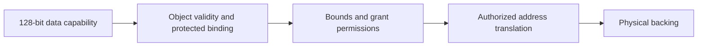

# Delegated memory addressing: Linux pointers and Capstone capabilities

Status: ARCHITECTURE PROPOSAL, 2026-09-30. The accepted pointer-size constraint
is 128 bits for domain pointers. The translation mechanism described here is
a proposed extension; it is not implemented or qualified by this document.

The [physical-grant plan](../plans/delegation-memory.md) remains the first
implementation stage. The [alternatives and prior work](../plans/delegation-memory-options.md)
explain the architectural recommendation. This document specifies the intended
meaning of physical and translated capabilities, their lifetime boundaries,
and the questions an implementation must resolve. The later
[caplified mapping tables candidate](caplified-mapping-tables.md) narrows this
to a first stage with capability-bearing table entries; its §11 records where
it supersedes sections 3, 6 and 8 here.

## 1. The proposed change

Today a domain data capability contains a physical cursor and bounds over a
physical extent. The proposed translated data capability has a logical cursor
and bounds over a logical interval. Protected metadata binds that capability
to a memory object, an access grant and an authorized translation context.
Physical capabilities remain the authority underlying the actual RAM pages.

| Participant or layer | Pointer representation | Meaning of the address |
|---|---|---|
| Ordinary Linux software in this RV64 stack | 64-bit pointer | Virtual address interpreted through Linux's applicable page tables |
| Current Capstone domain | 128-bit tagged capability | Physical address within the capability's physical bounds |
| Domain using the proposed translation extension | 128-bit tagged capability | Logical address within the capability's bound memory object and translation context |
| Physical backing management | 128-bit physical capabilities | Authority over the actual RAM extents backing an object |

**128 bits is the width of the capability, not a 128-bit address.** The current
ISA has a 64-bit cursor and 128-bit capability representation. Bounds, permissions,
type and implementation metadata complete that representation; memory/register
tags additionally distinguish capabilities from ordinary data. The proposed
extension retains the 16-byte pointer footprint. It does not make Linux's ABI
use 128-bit pointers, or promise a fully usable 64-bit virtual address space.

The additional translation is useful because a contiguous logical interval can
cover noncontiguous physical pages. The OS supplies those pages; hardware still
requires valid authority for every access to their bytes.

## 2. What identifies a memory access

The following are semantic distinctions, not a demand for six separate hardware
tables or six fields in every pointer:

| Concept | Meaning |
|---|---|
| Physical backing | RAM extents and the capabilities authorizing their use |
| Logical memory object | A stable byte-addressable resource whose backing may be scattered |
| Translation context | Protected association of logical pages with authorized backing |
| Grant, or view | A particular access delegation, with its own lifetime, rights ceiling and current mapping permissions |
| Object capability | A fine-grained pointer derived for a particular allocation or subobject, with bounds and an object lifetime |
| Control capability | Authority to perform specified management operations, distinct from permission to read or write data |

For example, an allocator pool is a logical memory object. Individual malloc
allocations inside it have narrower capabilities and may have shorter lifetimes.
Two participants can access the same pool through independent grants, but creating
those grants must obey the underlying sharing and object-lifetime rules.

The essential rule is **capability-bound interpretation**: a data capability's
protected identity determines its grant and translation context. The currently
running domain, Linux process or satp value must not reinterpret the capability
as an address into some other object. Merely passing the capability to another
domain preserves the association.

Binding identity remains stable through derivation and delegation. Authorized
backing relocation may change the physical frames behind the same object, under
a protocol that preserves contents, tags and lifetime. Substituting an unrelated
allocation beneath an old capability is a different operation and cannot be
silently treated as relocation.

## 3. Representation within the 128-bit constraint

A conceptual data capability comprises a cursor, bounds, permissions, a type
such as linear/non-linear, and an unforgeable link to lifetime metadata. These
are semantic fields; the following is not a proposed bit allocation:

```text
128-bit tagged capability
    cursor + compressed bounds + permissions/type + lifetime identity

protected metadata reached through that identity
    object lifetime + grant binding + translation-context binding

grant and translation state
    grant lifetime/rights + logical-page to authorized-backing association
```

The inspected QEMU implementation already encodes a revocation-node ID in
`target/riscv/cap_compress.c` and keeps revocation state separately in
`target/riscv/cap_rev_tree.h`. Associating a grant and translation context with
that protected node is the first representation strategy to investigate. It
avoids assuming unused inline bits for another complete identifier. This is
an implementation candidate, not a claim about a finished silicon encoding.

Pointer arithmetic keeps the association. Narrowing bounds keeps it. SPLIT,
MREV and any other operation that creates a new lifetime node must propagate
the appropriate association. Object revocation and grant invalidation remain
different events even if their implementations share metadata or caches.

Physical and translated addressing must be distinguished by protected state.
Software cannot flip an ordinary bit to reinterpret a translated capability
as physical authority. Address interpretation is also separate from linearity:
"translated" does not imply "shared", and "physical" does not imply "exclusive".

The design does not require a monitor call for pointer arithmetic, bounds
attenuation or each allocation. Metadata inheritance belongs in the corresponding
capability operations. A practical access path needs bounded metadata lookups
or caches, rather than an unbounded walk through allocator ancestry on every load.

## 4. Access checks and MMU reuse



Conceptually, an access is allowed only when all these conditions hold:

1. The capability is authentic, its type allows the operation, and its object
   lifetime and grant are live.
2. The complete byte range fits its logical bounds, with overflow checked.
3. Its own permissions, current grant/page permissions and backing authority
   all permit the operation.
4. Every touched logical page resolves through the bound translation context
   to valid authorized backing, with supported alignment and memory attributes.

This describes required outcomes, not a mandatory ordering of pipeline stages.
The rules cover data access, capability loads/stores, atomics and, when translated
code is supported, instruction fetch. Cross-page operations need their own
defined fault, partial-effect and atomicity rules. Page boundaries cannot permit
tag duplication or bypass a fine-grained bound.

Reuse of the existing page walker and TLB is the preferred implementation route.
It requires a capability-selected protected context and suitable cache keys and
invalidation. Enabling the current Linux satp for C-mode access is insufficient.
Neither a TLB hit nor a cached permission may bypass revoked object/grant state.
A received capability must remain usable according to its own authority even
when the receiving domain has a different ordinary translation context.

The binding and translation state must be protected against unauthorized
mutation. Whether mappings use capability-bearing leaves, protected ordinary
PTEs with separate backing authority, or another checked representation remains
an implementation choice. Integer physical page numbers alone cannot mint rights.
The walker's own accesses to translation storage, including accessed/dirty-bit
updates, must also be authorized. A grant to application data must not implicitly
grant permission to modify the structures controlling its translation.

## 5. Worked example: three scattered pages

Use 4 KiB pages for this example. These illustrative addresses are not an ABI,
board memory layout or proof of capability-bound representability:

| Logical range in object M | Physical backing |
|---|---|
| `0x40000000 .. 0x40000fff` | Page at `0x82000000` |
| `0x40001000 .. 0x40001fff` | Page at `0x86000000` |
| `0x40002000 .. 0x40002fff` | Page at `0x8a000000` |

The resulting object has a contiguous logical length of 12 KiB. The physical
pages are not adjacent. A root data capability delivered to the domain has
logical bounds `[0x40000000, 0x40003000)` and a binding to object M through grant G.
Let `p` be a `char *` holding that capability:

| Access | Required interpretation |
|---|---|
| `p[0]` | Byte at physical address `0x82000000` |
| `p[4095]` | Last byte of the first physical page |
| `p[4096]` | Byte at physical address `0x86000000` |
| `p[8192]` | Byte at physical address `0x8a000000` |
| `p[12288]` | Out-of-bounds access; must fail even if another mapping follows |

Derive a capability `q` for exactly the 128 bytes starting at `p + 4096`.
Subject to admitted bounds representability, `q[127]` succeeds and `q[128]`
fails. That check concerns the allocation boundary within a page, independently
of whether the whole page is mapped and writable. Forming a representable
one-past pointer is distinct from dereferencing it.

Linux might separately map those same backing pages at an entirely different
virtual base, such as `0x20000000`. Its 64-bit pointer is not interchangeable
with `p`: neither its numeric value nor a cast creates the domain capability.
For an exclusive grant, any Linux authority to access those pages must be
withdrawn before delivery. A remaining kernel PTE or bookkeeping reference is
not permission to access them. For deliberately shared backing, both participants
can retain appropriate access to the same pages.

This scattered example requires the proposed extension. The physical-grant
baseline can grow using several contiguous pools, but cannot present these
three scattered pages as one ordinary contiguous physical pointer interval.

## 6. Ownership and lifecycle

### Creating and delivering an exclusive mapping

1. Linux allocates and retains the backing; the module/monitor path obtains
   actual authority over the allocated extents. Linux-side lifetime references
   keep the frames from being freed prematurely.
2. The owner authorizes creation of the logical object and grant. The monitor
   checks extents, geometry, permissions and conflicts using real capabilities.
   Failure unwinds acquired references and authority without publishing a grant.
3. Physical authority is safely encapsulated by the mapping object. No
   independently usable physical linear capability may coexist with the
   purported exclusive translated access to those same bytes. Required
   initialization and exclusion of conflicting access complete before publication.
4. The monitor delivers the translated data capability through the protected
   resume slot. The scalar reply identifies completion, length and status; it
   does not manufacture a capability from an integer.
5. Libc records the mapping. An allocator may use it as a pool and derive bounded
   pointers according to its existing allocation and object-lifetime policy.

An exclusive translation must not map two separately derivable logical ranges
to overlapping physical bytes. Otherwise splitting the logical capability could
manufacture two exclusive authorities for the same storage. Such repeated-frame
aliases require shared semantics or rejection. Distinct virtual addresses do
not prove distinct physical ownership.

### Passing a pointer versus creating an independent grant

Passing a capability from A to B preserves its object and grant binding. For a
linear capability, existing move semantics apply; a non-linear capability may
be copied. In either case the capability means the same thing in B.

If the capability belongs to G_A, withdrawing G_A invalidates access through it
in both domains. A domain switch does not attach it to a new grant automatically.
To let B retain access after G_A ends, a holder of suitable management authority
must explicitly create G_B over eligible shared backing. Permissions and detach
lifetimes can then differ between G_A and G_B.

Creating G_B must not resurrect a revoked fine-grained object or silently widen
an existing delegation. The relation between shared-object lifetime and the
two grant lifetimes needs explicit semantics. A linearly transferred management
handle to shared memory does not establish exclusive ownership of its bytes.

### Protection, object free and unmap

| Operation | Intended effect |
|---|---|
| Narrow a data capability | Bound the result and future derivations from it; existing other aliases retain their rights |
| Change G_A from RW to R | Existing G_A pointers remain readable but lose writes; G_B follows its own policy |
| Restore G_A to RW within its ceiling | Existing pointers whose own rights include W may write again; explicitly R-only pointers stay R-only |
| Revoke an allocation | Invalidate the affected object's aliases according to the allocator's revocation policy |
| Detach G_A | End G_A access, including passed and spilled copies; preserve independent eligible grants |
| Reclaim physical backing | Withdraw every conflicting authority, complete invalidation and the required scrub/initialization protocol, then permit reuse |

Changing mapping protection requires separate control authority. A writable
data pointer does not inherently authorize restoring mapping permissions or
altering page bindings. A deliberately independent alias has its own authority;
protecting one grant does not claim to protect every possible alias to the bytes.

These are proposed translated-memory semantics, not a mechanical reuse of
existing REVOKE. In particular, detaching one shared grant cannot return an
exclusive physical root while another grant survives. Existing physical numeric
interval comparisons also cannot directly define aliasing for capabilities
bound to different logical objects. The extension needs an identity-aware
revocation model and a proof that its backing rules preserve physical exclusivity.

The syscall return, backing release or grant-reuse point must follow a defined
completion boundary: prohibited accesses can no longer retire, including on
other harts, through cached translations or from resumed contexts. Crash cleanup
uses the same lifetime rules. Linux cannot free a frame merely because a launcher
exited while another participant still has a live grant.

## 7. What remains unchanged at the Linux boundary

Linux continues to choose pages and handle file descriptors, file offsets,
page-cache policy and writeback. The monitor handles generic authority and
mapping operations. The domain derives and uses its application pointers.

Requests remain scalar rows with checked lengths, offsets and opaque identifiers.
Pointer-returning domain APIs obtain real capabilities through protected delivery.
The launcher uses Linux pointers for Linux syscalls. It cannot pass a domain
capability's cursor to a Linux syscall and assume it names the same buffer.
Buffer transfer continues to require an authorized sharing/transfer mechanism
or the existing exchange path. A raw wire identifier does not convey memory
authority by itself.

Shared Linux/domain mappings share bytes under this proposal, not automatically
their pointer representation. Ordinary Linux code cannot dereference a stored
128-bit domain capability as a native pointer. Shared structures intended for
both ABIs should use agreed scalar fields and relative offsets, deriving local
pointers through each participant's authorized access path. Tag-bearing shared
storage, concurrent writes to capability slots and cross-ABI atomics need explicit
rules; they are not established by coherent physical pages alone.

Translation does not by itself implement file mmap. Correct shared-file support
also requires stable Linux backing references, invalidation/truncation handling
and dirty reporting. Private page movement, swap, COW and fork have additional
confidentiality, integrity and linear-capability obligations. Those are later
contracts, described in the alternatives document.

## 8. Decisions still required before an implementation claim

| Area | Question to resolve |
|---|---|
| Logical namespace | Are cursors object-relative or drawn from a larger logical address space, and how are intervals reserved? |
| C ABI | How do pointer equality, ordering where defined, hashing, integer conversions, serialization and relocation preserve the intended identity? |
| 128-bit representation | How is the protected binding encoded or reached, and what bounds remain representable? |
| Translation hardware | How does C-mode select the bound context and retain physical authority through the walker and TLB? |
| Lifetime metadata | How do derivation, revocation, spills, cached state, node reuse and generation wraparound avoid reviving stale capabilities? |
| Shared objects | How do independent grant lifetimes intersect common fine-grained object lifetimes? |
| Partial unmap | How can an old capability retain access to surviving bytes without gaining access to a new allocation in a reused hole? |
| Code and special storage | How do translated instruction fetch, sealed contexts, capability stores, atomics and device access interact with the new interpretation? |

The example chooses a logical base for clarity; it does not settle the namespace
or C ABI. The ISA change must define both before treating existing application
behavior as compatible. Retaining 128-bit width alone is not proof of unchanged
pointer semantics, object layout requirements or instruction behavior.

## 9. First implementation experiment and acceptance criteria

Continue physical runtime grants as the executable baseline. Model translated
data access with resident pages before adding files or demand paging. Existing
direct physical capabilities can support bootstrap and monitor operation while
the prototype exercises the additional interpretation.

| Experiment | Required observation |
|---|---|
| Three scattered pages, one logical interval | Ordinary bounded pointer arithmetic reaches the expected bytes across page boundaries |
| Narrow 128-byte object inside a mapped page | In-bounds access succeeds; access beyond the object fails |
| Pass a capability to a domain with different current page tables | It still designates the same object under the same grant |
| Submit unauthorized backing or duplicate exclusive frame aliases | Mapping is rejected without leaving published partial authority |
| Save aliases in registers, memory and suspended contexts, then revoke | Old aliases fail; fresh authorized allocations work |
| Create G_A and G_B, then detach G_A | G_A aliases fail everywhere; G_B retains its permitted access |
| RW to R to RW | Old RW-capable aliases follow current grant permissions; R-attenuated aliases never gain W |
| Reuse an address or identifier | Stale capabilities do not acquire authority over the replacement object |
| Reclaim with concurrent access and cached translations | Reuse follows the specified completion boundary; no forbidden access retires afterwards |

These are proposed acceptance tests, not completed results. Pair denials with
successful authorized operations. Measure metadata footprint, translation and
revocation cache behavior, and protection/unmap completion costs. The accepted
16-byte pointer footprint does not pre-judge those implementation costs.

## 10. Source and proposal boundaries

The current width and mode distinctions are specified in the
[Capstone-RISC-V reference](https://capstone.kisp-lab.org/specs-caplifive/main.pdf),
sections 1.4, 2.1 and 2.3. CapliFive supports ordinary virtual-memory accesses
under physical capability authority in lower privilege modes; the translated
C-mode data capability described here is additional proposed work.

The [prior-work comparison](../plans/delegation-memory-options.md#10-prior-work-and-the-scope-of-the-proposal)
relates this proposal to caplification, Cichlid, Elasticlave, Sanctum and CheriABI.
Their existence supports the choice of mechanisms, but does not establish the
new Capstone composition, its novelty or production readiness.
