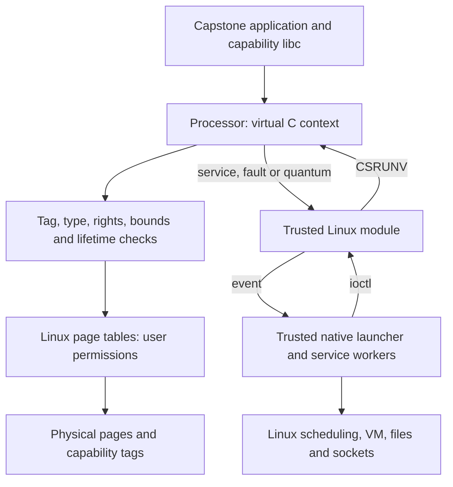

# Understanding virtual Capstone

Virtual Capstone lets capability applications use ordinary process virtual
addresses. The processor enforces capability authority; a trusted operating
system supplies page tables, physical pages, scheduling and system services.
The integration goal is a reusable processor interface with a small OS adapter.

This guide describes the **supervised virtual C implementation under review**,
as of 2026-10-07. Applications still run in C mode. Linux runs the native
launcher and its worker threads, and a loadable module connects them to the
processor. The recorded platform needs no additional Linux-core or firmware
patch. This is a QEMU implementation, not a released RTL interface.

## Read in this order

| Question | Chapter |
|---|---|
| What does a capability own, and what happens at `free`? | [Ownership and lifetimes](ownership.md) |
| How do startup, syscalls, allocation and threads work? | [Runtime and Linux](runtime.md) |
| What changed in the processor? | [ISA and context interface](isa.md) |
| How do I build a program or find the relevant code? | [Development and source map](development.md) |
| What has been tested, and what is still limited? | [Guarantees and evidence](guarantees.md) |

## The system in one picture

There are two roots for an address-space instance `A`: its page-table root
`P_A` and its lifetime-table root `N_A`. Translation asks where a virtual
address is backed. The lifetime table asks whether a capability still belongs
to a live allocation. Both checks matter: remapping the same virtual address
must not make a freed pointer valid again.

## What becomes virtual

| Property | Physical domain path | Supervised virtual C path |
|---|---|---|
| Capability cursor and bounds | Physical address ranges | Virtual ranges in the owning address space |
| Application backing | Runtime-managed physical regions | Linux mappings, potentially scattered physical pages |
| Lifetime identity | Legacy revocation namespace | Local node ID interpreted in the selected process namespace |
| Entry and service boundary | Physical domain/monitor protocol | Module entry and resumable processor events |
| Capability tags | Physical storage identity | Still physical storage identity |
| Trust boundary | Physical domain/monitor model | Linux, adapter and runtime are trusted |

A large virtual range can span noncontiguous physical pages. The runtime no
longer needs a large contiguous physical payload pool. It still uses arenas
to amortize allocation: an arena is now a Linux-backed virtual mapping from
which libc carves objects. Ordinary applications call `malloc` and `mmap`.
The current lifetime table itself is still a contiguous physical allocation.

## Responsibilities

| Layer | Responsibility |
|---|---|
| Processor | Check capabilities and translations; move linear authority; revoke lifetimes; preserve suspended capability contexts |
| Trusted OS adapter | Bind contexts to the owning address space; mint roots; track backing and retire authority before reuse |
| Linux | VM policy, page faults, physical allocation, native scheduling and kernel services |
| Runtime and libc | Startup, delegated calls, heap lifetimes, mapping requests and the pthread bridge |
| Application allocator adapters | Give internal objects their own bounds and lifetimes when they subdivide a larger allocation |

Trusting Linux makes ordinary kernel access to memory acceptable. It does
not make ordinary scalar Linux register saves preserve capability metadata.
The processor's continuation interface solves that integration problem:
Linux schedules native workers while the processor retains each paused
application's full capability state.

## Terms used throughout

| Term | Meaning |
|---|---|
| Capability | A tagged pointer with bounds, permissions, a type and a lifetime node ID |
| Tag | Metadata distinguishing a capability from ordinary bits; software cannot create authority by copying scalar bytes |
| Linear capability | Move-only authority; splitting partitions its range into separate owners |
| Non-linear capability | Copyable access authority, still subject to bounds and revocation |
| Revocation handle | Authority to invalidate subordinate lifetimes and reclaim a region |
| Namespace | The lifetime table selected for an address-space instance |
| PCC | The capability authorizing instruction fetch |
| Context / continuation | One suspended application's registers, PCC and bound roots |
| Arena | A registered backing range containing one or more allocator objects |
| TCB | Trusted computing base: components whose correctness the guarantees assume |

The [reference revisions and evidence](guarantees.md#reference-revisions)
make this guide independent of changing branch tips. The earlier protected
U-mode proposal is a separate experiment; its Linux entry-save ABI and
proposed instructions must not be read as the interface described here.
