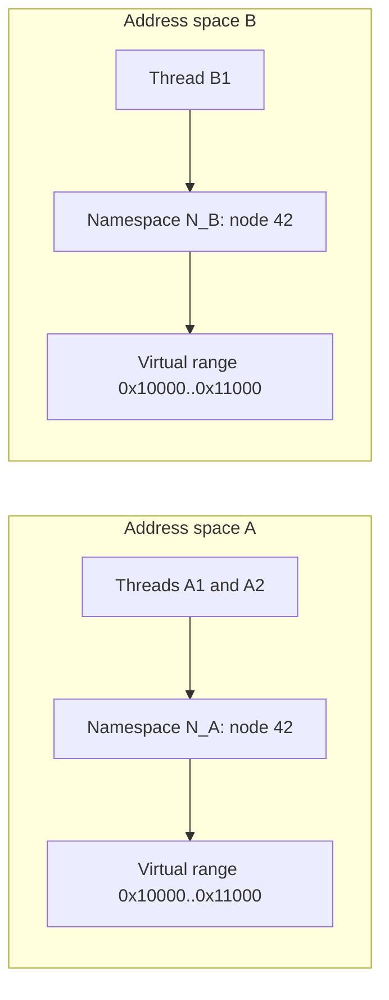
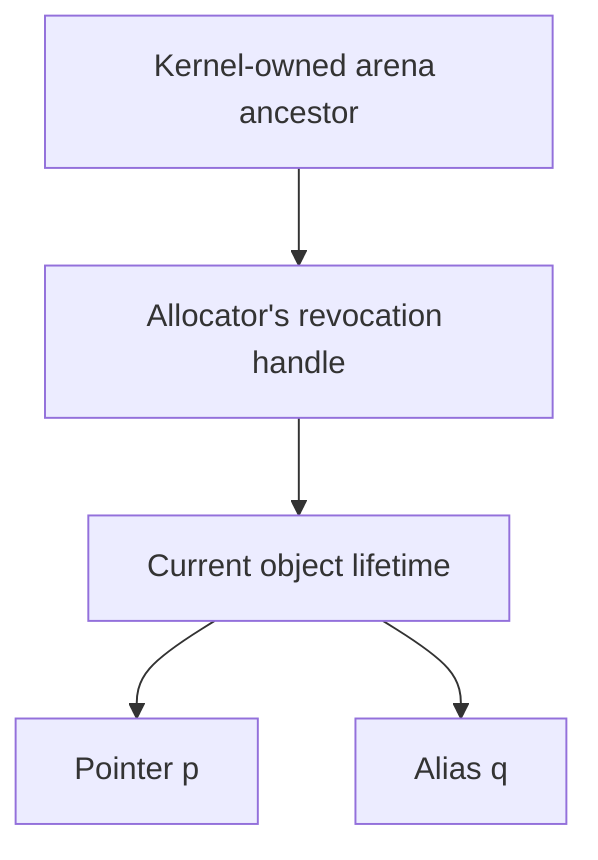

# Ownership and lifetimes

[Guide](README.md) · Next: [Runtime and Linux](runtime.md)

Ownership is scoped to **one virtual address-space instance**. All its
threads share the same ownership and lifetime namespace. Separate processes
may use identical virtual addresses and node numbers without sharing authority.

## Address, authority and lifetime are different

A capability conceptually contains:

```text
tag + [virtual base, virtual end) + cursor + rights + type + local node ID
```

The running context supplies the namespace. Thus the logical lifetime
identity is `(N_A, node_id)`, although the namespace is not encoded in every
pointer. An integer address alone carries no capability authority.



Revoking node 42's descendants in `N_A` has no effect on `N_B`. Copying a
tagged value across namespaces is not a supported transfer protocol. The
trusted adapter must prevent that reinterpretation and overlapping root
grants or aliases that would duplicate linear authority.

## Linear ownership and ordinary C pointers

A linear capability can move between a register and memory or between
threads, but a successful move consumes its source. `SPLIT` partitions its
range; it does not create two owners of the same bytes. A retained revocation
handle is management authority, not a second ordinary read/write pointer.

C programs need aliases. The allocator creates a senior revocation handle,
then uses `DELIN` to turn the child into a copyable non-linear pointer.
Copies keep the child's lifetime identity. Revocation invalidates them all.
Therefore “linear ownership” does **not** mean every C pointer is move-only.

For a linear load, reading the slot also consumes it. Consequently `LDC`
needs write permission to that slot as well as read permission. The
[transfer contract](isa.md#linear-transfers-and-faults) checks everything
before either source consumption or destination publication.

## A malloc/free example

The diagram shows authority relationships, not the table's storage layout.
Several split block roots can sit beneath the same arena ancestor.



1. Linux supplies backing; the adapter mints an arena grant beneath its
   private ancestor. The heap splits the grant into blocks.
2. `malloc` retains a handle, delinearizes the child and bounds the returned
   pointer to the allocation's representable extent.
3. `q = p` copies a non-linear capability. Both pointers name the same lifetime.
4. `free(p)` revokes the object subtree before making the block reusable.
   `q` may retain its address bits and even a tag, but its dead node denies use.
5. A later allocation at that address receives a new lifetime. The old
   pointer stays invalid. Numerical node-ID reuse requires the sweep below.

For nested allocators, the heap can instead loan a **linear** block and keep
its senior handle. The nested allocator splits it and creates object
lifetimes. Returning the block revokes all those descendants before reuse.
An allocator that merely reuses bytes inside one still-live outer allocation
does not obtain inner temporal protection automatically.

## What REVOKE means here

Abstractly, `N_A` is a forest. `REVOKE(R)` invalidates the proper descendants
of `node(R)` in that forest, leaving the operand node live. It requires a
revocation capability and transforms that handle into reclaimed authority.
If a linear descendant was revoked and the handle has write permission,
the result is `UNINIT`; otherwise it is linear. The cursor returns to the
base. An `UNINIT` region must be initialized before it becomes readable
linear authority again. The runtime retains this rule.

The implementation stores a depth-ordered list and walks the affected run.
Accesses check their own record, so just marking an ancestor invalid would
leave descendants usable. Privileged `CSRETIRE` performs the walk and also
invalidates the arena ancestor itself. Equal bounds in another process do
not participate in the walk.

## Revocation and ID recycling are separate operations

The table is bounded. Revocation makes an ID dead; it does not immediately
make that ID safe to reuse. A stale tagged pointer could otherwise name a
newly allocated record with the same number.


The trusted adapter stops the namespace and supplies every physical page
that may hold its capability tags, including resident `PROT_NONE` pages
and entry/reply frames. QEMU clears dead memory tags and dead tagged GPRs
in all saved contexts with that root. Dead PCC identities stay pinned
because PCC has no separate tag to clear. Only then may invalid, unpinned
IDs enter the free list. There are no generation bits in this prototype.

This is not application garbage collection: live records remain live even
if application code has lost its last useful pointer. Table demand includes
handles, object nodes, retired IDs awaiting collection and pinned identities.
It is not just the count of simultaneously live malloc objects.

## Relationship to Rust

The useful analogy is exclusive ownership that can move, plus controlled
ways to share access. Rust's ownership and borrowing rules are language
rules; the borrow checker does not define ownership by an OS page-table root.
This Capstone profile makes the **architectural enforcement domain** explicit:
one virtual address space, shared by its threads.

Capstone does not infer Rust references, prove C data-race freedom or prevent
every logical aliasing bug. Non-linear aliases are permitted, and mutexes
still matter. The compiler and allocator must express the bounds and
lifetimes that the processor should enforce.

Implementation references: [Sublet operations][sublet], [virtual heap][heap],
[revocation algorithm][tree], [namespace sweep][supervisor]. See
[guarantees](guarantees.md) for representability and trust assumptions.

[sublet]: https://github.com/project-starch/llvm-capstone/blob/518a5b805aa70c222ef0496c151b2845b4ab8dae/capstone/runtime/include/sublet/sublet.h
[heap]: https://github.com/project-starch/llvm-capstone/blob/518a5b805aa70c222ef0496c151b2845b4ab8dae/capstone/runtime/virtual/heap.c
[tree]: https://github.com/project-starch/capstone-qemu/blob/9bf9c1f28653632c2ce93a10d4bdd69eb26e04b9/target/riscv/cap_rev_tree.c
[supervisor]: https://github.com/project-starch/capstone-qemu/blob/9bf9c1f28653632c2ce93a10d4bdd69eb26e04b9/target/riscv/capstone_supervisor.c
