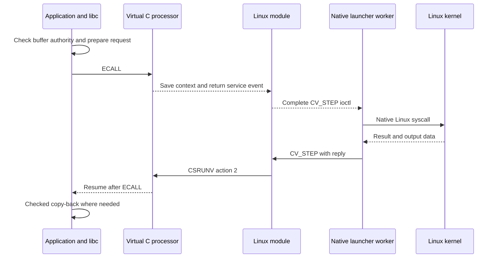
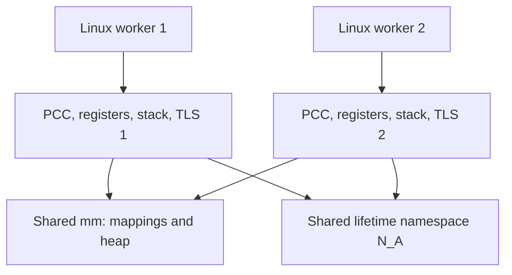

# Runtime and Linux

[Guide](README.md) · Previous: [Ownership](ownership.md) · Next: [ISA](isa.md)

The runtime reuses Linux rather than becoming an OS. `capstone-vexec` is a
native Linux program; `capstone_vm.ko` is a loadable module. The capability
application executes as a supervised virtual C context associated with that
process. Linux schedules the native workers, while the processor holds the
paused capability register state.

## Startup

1. The launcher validates the application's ELF/profile marker and maps its
   image, stack, startup data and service transport into its Linux `mm`.
2. The module creates a private lifetime table and the main context frame.
   It binds the device instance to the owning `mm`; another namespace for
   that same `mm` is refused.
3. For each registered range, `CSMINT` creates a private ancestor and a child
   grant. The module retains the ancestor ID and prepares initial capabilities.
4. Through `CV_STEP`, the module invokes `CSRUNV`. The processor consumes
   the initial capability slots, binds the page-table and lifetime roots,
   and starts the application's CRT and `main`.

The virtual compiler profile uses `-capstone-gp-free` for ordinary calls
within PCC and `-capstone-image-gp` for a readable image capability covering
globals and constant pools. Rebuild application objects and dependencies
with this SDK; relinking physical-profile objects is insufficient.

## A syscall, from application to Linux and back

For an ordinary delegated call such as `write(fd, buffer, length)`:



The capability-side bridge checks the full buffer span, type and rights.
Vector/message operations retain the descriptors they checked for transfer
and copy-back. The native service side validates the exchange protocol and
executes Linux calls using scalar addresses and native layouts. Many calls
use exchange/bounce buffers; this is not a zero-copy direct-syscall ABI.

The module writes scalar results as untagged `a0`. Mapping replies instead
transfer a capability through a consumed reply slot. Service completion
advances PC past the ECALL exactly once. A page-fault retry keeps the same PC.

This service boundary does not enter the physical domain monitor for each
call. Firmware remains part of the platform boot environment. The existing
physical monitor and its domain protocol remain a separate execution path.

## malloc, mmap and the meaning of an arena

Most `malloc`/`free` calls stay inside capability libc. The heap uses size
classes, revocation handles and a shared metadata lock. When it needs more
space, it sends a VM MAP request. The native launcher obtains Linux anonymous
backing and the module registers it and supplies a linear grant.

```text
Linux mapping -> linear arena grant -> split blocks -> object lifetimes
                                                       malloc / free
```

Backing, visible mapping length and individual object bounds are distinct.
The current heap uses power-of-two blocks of at least 256 bytes. Returned
bounds are narrowed to the request, with representability rounding for
requests of at least 4 KiB. That small padding is accessible within the
block; the implementation does not promise byte-exact requested bounds for
every size. Heap metadata grows through separate VM mappings without
recursing into malloc. Completely free payload arenas can be returned by
`malloc_trim` while metadata remains valid.

Public anonymous `mmap` uses the same service, then makes the grant copyable.
It supports `PROT_NONE` and R/W/X protection combinations, page-range
`mprotect`, and whole-mapping `munmap`. The mapping capability has maximum
anonymous-mapping rights; PTEs supply the current protection. Restoring PTE
write access cannot restore rights removed from an individual capability.
Public lengths are page-rounded. Internal backing padding stays `PROT_NONE`
and cannot be exposed through the public protection operation.

Unmapping is ordered: retire the ancestor and descendants, clear tags from
the tracked backing, release pins, then release the mapping. Management uses
the registered range, so retiring a `PROT_NONE` mapping does not need to read
through the application pointer. Partial unmap and fixed replacement need a
further contract: an old wide capability must not acquire a new allocation
placed into a hole in its range.

## Page faults and scheduling

Growing mappings can start without resident pages. A processor page-fault
event returns to the module, which checks the VMA's existing permissions and
asks Linux to resolve a permitted fault. The adapter then pins the backing.
Denied access is not repaired by widening permissions. Already tracked pages
must retain their physical identity, because tags live on physical storage.

The processor also returns a quantum event when application code never
yields. The native worker returns through Linux and can be descheduled.
The current 5-ms QEMU quantum is implementation policy, not an ISA timing
guarantee. One hart and serialized entry make namespace-wide collection
possible without designing a multi-core shootdown protocol.

## Threads share memory and lifetimes



Musl owns pthread objects, TLS layout, mutex/condition state and join semantics.
The adapter supplies context creation, Linux workers, native-address futex
waits and final exit. Revocation by one thread affects matching lifetimes in
every thread. It provides no protection against ordinary data races between
live aliases.

Each POSIX worker has its own request/exchange state, bounce buffer and
signal state. Blocking I/O releases the process service lock so another
worker can progress. Epoll and message conversion descriptors are private to
each call. A thread's virtual context and frame stop before its exit word is
cleared and joiners are awakened. Only then may its stack/TLS be reclaimed.

The explicit context API also accepts a tagged startup frame in a registered
user mapping. The module supplies its trusted roots immediately before first
entry; the processor consumes the initial slots. Later execution state lives
in the saved continuation, not in editable input register slots. Main-thread
frames are kernel-allocated. Thus “every frame is kernel-private” would be
an inaccurate description of the implemented thread path.

## Exit and the trust boundary

Process exit stops all native workers before the adapter releases mappings.
The module forgets saved contexts, retires registered arenas, clears tracked
tags and frames, and frees the lifetime table. Teardown avoids faulting in
unused pages of an exiting `mm`; Linux's ordinary zeroing clears residual
tags when untracked backing is reused. Collection, in contrast, requires
complete inspection of resident registered storage before any ID is recycled.

Linux, the module, native launcher and the relevant runtime/allocator policy
are trusted. The module briefly uses tagged temporary registers when
preparing grants, with interrupts and preemption excluded. Ordinary kernel
C code remains scalar; Linux needs no general capability register-save ABI
for this supervised path. Another OS would need an adapter for these same
lifecycle duties; portability to a second OS has not yet been demonstrated.

Sources: [launcher][exec], [module][module], [heap][heap], [mapping libc][mapping],
[pthread bridge][pthread], [software service numbers][abi].

[exec]: https://github.com/project-starch/llvm-capstone/blob/518a5b805aa70c222ef0496c151b2845b4ab8dae/capstone/runtime/virtual/exec.c
[module]: https://github.com/project-starch/llvm-capstone/blob/518a5b805aa70c222ef0496c151b2845b4ab8dae/capstone/runtime/virtual/module/capstone_vm.c
[heap]: https://github.com/project-starch/llvm-capstone/blob/518a5b805aa70c222ef0496c151b2845b4ab8dae/capstone/runtime/virtual/heap.c
[mapping]: https://github.com/project-starch/llvm-capstone/blob/518a5b805aa70c222ef0496c151b2845b4ab8dae/capstone/runtime/virtual/mapping.c
[pthread]: https://github.com/project-starch/llvm-capstone/blob/518a5b805aa70c222ef0496c151b2845b4ab8dae/capstone/runtime/virtual/pthread.c
[abi]: https://github.com/project-starch/llvm-capstone/blob/518a5b805aa70c222ef0496c151b2845b4ab8dae/capstone/runtime/virtual/vm-abi.h
