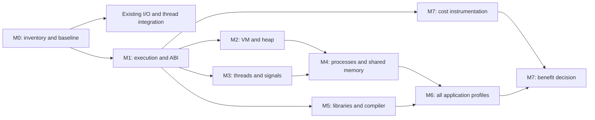

# Linux application compatibility with object memory protection

Status: PROPOSED MILESTONES, 2026-09-30, on `memory-trusted-linux`.
This is an execution plan for the [trusted Linux design](../design/trusted-linux-memory.md),
not a new implementation or qualification result. Its M0–M7 names are local
to this plan; they do not continue the caplified mapping milestones.

## 1. Fixed goal, open implementation

**Our applications should use the same operating-system functions as ordinary
Linux processes. Linux supplies those functions; our contribution controls
memory authority, object bounds and lifetimes.** Missing IPv6, file mappings,
threads, process creation or dynamic loading are integration defects to remove,
not properties of the protection model.

Linux and relevant privileged software are trusted. Application inputs remain
untrusted. Bounds checks and revocation still have to work when an access is
performed through a syscall, another thread or an asynchronous operation.
The protection scope must distinguish libc allocations from objects inside
application pools, and heap lifetimes from stack and global-object lifetimes.

The goal is source and functional compatibility, not binary compatibility
between existing 64-bit libraries and our capability ABI. Recompilation and
changes for pointer representation, alignment, authority or lifetime can be
necessary. Replacing an OS function with a stub is not a completed port.

Capstone is the current research platform. The final execution mode and ISA
integration remain an M1 decision. Trusting Linux does not itself enable
capability instructions in Linux user mode or translate C-mode accesses through
Linux page tables. The current module and monitor can remain a migration bridge;
their removal is not a prerequisite for restoring useful functionality.
[Caplifive modes](https://capstone.kisp-lab.org/specs-caplifive/)

## 2. Starting point and common acceptance rule

The [shared application SDK](../../ports/common/application/README.md) already
builds seven application entry points. Extend this platform once and rebuild
every application against it. Do not create seven syscall runtimes.

Existing work to reuse, with its scope preserved:

- The SDK's build manifests, native output oracles and common launch/cleanup
  gates provide the regression foundation. The seven qualified workloads are
  narrower than seven fully compatible application distributions.
- [Heap qualification](capstone-heap-protection.md) already tests bounds,
  stale aliases, address reuse and stale `free` on QEMU. It does not establish
  dynamic Linux VM integration or concurrent protected allocation.
- The separate thread lane has real TLS and CPython thread tests. Its
  [record at `305d2fd6bdc7`](https://github.com/project-starch/llvm-capstone/blob/305d2fd6bdc745ca1a604df16fc961fba3e6b7a9/capstone/ports/cpython/app/results/thread-review-2026-09-30.json)
  counts 448 tests, including 38 skips, with no errors or failures. That is
  evidence for its named build, not an integrated result on this branch.
  Preserve the newer I/O rows when integrating it; its epoll exclusion must
  not overwrite an implementation available on the integration base.
- The [descriptor-service record](../../runtime/tests/application/results/20260930-fd-rows.json)
  already covers eventfd/timerfd and other rows. Historical ENOSYS lists are
  not a current feature inventory.

For each application, freeze an upstream version and a **target Linux profile**:
dependencies, enabled features, privileges and upstream tests on ordinary
Linux with musl. Existing restricted native controls are useful regressions,
but are not the target profile. Do not disable a native feature merely to match
a missing capability implementation. Optional product choices may remain
optional when independently justified and applied to both targets.

Every missing feature, configure override, stub and test exclusion gets a row:
source location, observed failure, cause, owning layer, milestone, native result
and acceptance test. Classify it as OS integration, capability ABI/compiler,
dependency/build configuration, resource limit or unresolved defect. Retained
capability adaptations need a representation/bounds/lifetime explanation.

A feature is complete only when its positive tests, error paths and relevant
memory-safety controls pass on the same pinned platform. Record pass, fail,
skip, not-built and not-run separately. A runtime gap reported as an upstream
skip still blocks that feature's completion. Snapshot compiler, libc, kernel,
module, firmware, emulator and application identities; verify what actually
boots and loads, not just what was built.

## 3. Milestones and exit gates

### M0 — Establish the compatibility baseline

**Work:** Build the feature/patch inventory above for all seven applications,
using their recipes and generated configurations. Run native target profiles
and existing capability workloads. Put the matrix and runners beside the
shared SDK; derive application membership from `port.json`. Map failures to
common platform work rather than assigning a separate workaround to every app.

**Done when:** Every forced-off feature and exclusion has a disposition and
test; native and capability results are reproducible; the runner detects a
deliberately missing service or wrong runtime. Select representative workloads
and cost limits before measurements. M0 does not require all features to pass.

### M1 — Choose and demonstrate the Linux execution and capability boundary

**Work:** Compare extending the present C-mode bridge with capability execution
in a Linux user process. Use an established MMU-compatible capability system
as a reference; retain Capstone-specific mechanisms only where justified.
Specify privilege transitions, ordinary page translation, process lifetime
state, syscall arguments and tag-preserving context save/restore. Identify
which changes belong in LLVM/libc, Linux, the bridge and hardware/QEMU.

Model context isolation, VM retirement, private cloning and access completion
before committing to their encoding. A bounded model finds counterexamples;
it is not a proof of the implementation. Then demonstrate one small process
with an ordinary Linux mapping, a restartable page fault, preemption/resume and
one buffer syscall. Exercise integer, FP, atomic and capability access paths.

**Done when:** A reviewed architecture decision and executable prototype show
both capability checks and Linux page permissions enforced. Ordinary loads or
a syscall with a stale/out-of-bounds buffer cannot bypass object authority.
The cost and required hardware changes are explicit. If the present mode needs
extensive OS duplication, change the integration choice before building on it.
[CHERI's MMU integration](https://www.cl.cam.ac.uk/research/security/ctsrd/cheri/)
is prior art, not a new contribution claimed here.

The `trusted-linux-syscall-bounds` lane is an interim bridge slice: object
bounds in the default heap, requested-span checks at the delegated buffer
boundary and an end-to-end `read`/`readv` test. Its one-hart result is recorded
in [the buffer boundary result](../../runtime/tests/application/results/20260930-syscall-buffer-bounds.json).
The Linux user-mode ABI, concurrent revocation/copy-fault recovery and the
full M1 gate remain open.

The [ordinary Linux feasibility control](../../tests/trusted-linux-feasibility/README.md)
now runs `mmap`, `mprotect`, `malloc/free`, `fork`, a pipe `read`, and `munmap`
under the experimental QEMU CPU property. Its record explicitly marks the
process unprotected. It establishes that the guest and runner can exercise
these OS calls before M1 adds per-process selection and tagged context transfer;
it does not satisfy any protected-process part of the M1 exit gate.
The stacked [S-mode context experiment](../design/trusted-linux-execution-boundary.md)
shows tagged register preservation across one bare-metal U-to-S trap and
detects a scalar save; Linux's `pt_regs` and task switching still use scalar
register slots. The next gate must run the same round trip in a Linux-selected
process, then add a checked buffer syscall and allocator lifetime test.

### M2 — Real virtual memory and a growing protected heap

**Work:** Connect libc allocation to Linux anonymous and file-backed mappings;
qualify growth, page faults, `mprotect`, partial `munmap`, mapping replacement,
file truncation and address reuse. Use ordinary Linux VM semantics and one
process address space. Define tag treatment for zeroing, kernel/device writes,
page copying and reclaim; add tag-preserving paging before claiming swap support.
Reclaim lifetime metadata as well as backing storage.

**Done when:** Live objects survive heap growth beyond the launch arena; a
CPython file mapping observes the native file/update/protection behavior;
stale pointers remain invalid after free, unmap/remap and node reuse. Forced
memory/node exhaustion rolls back without leaks. Repeated growth/shrink with
a bounded live workload under fixed limits reaches a bounded steady state.
Retiring one range does not revoke an unrelated live range. QEMU exact bounds
are not an RTL compression test.

### M3 — Threads, synchronization and asynchronous signals

**Work:** Integrate the existing TLS/thread work with current I/O services.
Qualify libc synchronization, capability-valued atomics, concurrent protected
allocation, context teardown and signal frames. Deliver signals to a computing
thread without waiting for its next delegated syscall. Linux remains responsible
for scheduling, signal selection, futex waits and wakeups.

**Done when:** CPython thread/queue suites and libc concurrency tests pass with
every exclusion explained; thread capacity is governed by documented resource
limits rather than a silent fixed-context ceiling. Test signal interruption of
both computation and blocking calls. On at least two harts, delay a checked
access across `free`/`munmap`: storage must not be reused before that access
finishes or is cancelled. Single-hart QEMU success does not close this gate.

### M4 — Processes and shared memory

**Work:** Extend the existing spawn/exec/wait paths with real `fork` and complete
resource cleanup, initially with eager private-page/tag/lifetime cloning.
Preserve inherited dead identities and independent private frees. Then
qualify fork from a multithreaded process,
including libc's atfork rules. Restore process groups, descriptor inheritance
and subprocess options through Linux. Add shared mappings, POSIX shared memory
and process-shared synchronization; specify how shared authority is named and
retired instead of treating raw capability bytes as an import operation.

**Done when:** CPython fork, subprocess and multiprocessing/shared-memory tests
run without fork-disabled guards; parent and child can independently modify
and free private objects; stale inherited pointers stay invalid. PostgreSQL
can start a multi-process server, use shared state and shut down cleanly.
Shared bytes are not mistaken for a qualified shared-capability ABI: test
tagged sharing where required, with no foreign-authority import. Inject fork
failure and verify parent integrity and full child cleanup. COW is a later
optimization; eager fork can meet the functional gate.

### M5 — Libraries, extensions and compiler compatibility

**Work:** Support shared-library relocation, `dlopen`/`dlsym`/`dlclose`, TLS in
loaded libraries, function pointers, callbacks and the capability FFI. Build
the target dependencies once in the shared sysroot. Repair representation
issues such as pointers stored in narrow integers, unaligned pointer caches
and missing capability initializers for computed-goto tables.

**Done when:** CPython loads an extension and exercises a libffi callback;
the selected SSL, compression and database modules pass their tests; another
application loads a plugin using the same loader. Library unload follows a
documented lifetime rule that prevents later use of retired code/data authority.
Restore interpreter optimizations through representation-correct code, then
test them; enabling a configure flag alone is not qualification. Ordinary
byte I/O must never manufacture valid capability tags from file contents.

### M6 — Qualify application feature parity

**Work:** Restore features as M1–M5 make them available. Run the target profiles
and upstream tests continuously, not only at the end. The application matrix
below supplies integration gates; preserve current workloads as regressions.
Retain custom allocator adapters only to protect their inner objects, not to
replace Linux services. Full-program coverage requires auditing all allocation
paths; selecting a protected libc heap does not protect every pool member.

**Done when:** All seven applications meet their declared Linux feature profiles,
with no runtime-caused exclusions in those profiles. Every remaining source
adaptation has a capability-representation or object-boundary/lifetime reason.
The shared runner reproduces functional, failure-cleanup and safety results
from one coherent platform manifest. Allocator-only components get a separate
application-promotion gate before being counted as additional working programs.

### M7 — Establish that the protection is worth its cost

**Work:** Start cost instrumentation with M1; make the final decision after M6.
Compare native Linux, protection-disabled controls and suitably matched spatial
and temporal alternatives. Match application features, optimization, workload
and protection scope; report unavoidable platform differences explicitly.
Measure throughput, tail latency, startup/fork cost, total memory including
tags/nodes/retained pages, revocation/drain pauses and metadata reclamation.
Emulator wall time is not processor performance or hardware area evidence.

**Done when:** Predeclared budgets are met and a useful advantage is demonstrated
for a named workload and protection scope—for example, targeted lifetime
retirement with earlier safe reuse at acceptable total cost. Hardware claims
need RTL/silicon measurements. If there is no advantage over a simpler design,
simplify or change the mechanism. Compatibility, multithreading and total cost
are decision criteria throughout, reflecting the
[MPX evaluation's lessons](https://intel-mpx.github.io/overview/).

## 4. Application gates beyond the existing smokes

These are required directions for M0's concrete test profiles, not results.
Dependencies and optional features must be pinned there before qualification.

| Application | Existing qualification anchor | Additional integration gates |
|---|---|---|
| CPython | JSON/GC; separate thread-lane results | IPv4/IPv6 and selectors; file `mmap`; real fork/subprocess/process pools; shared memory; asynchronous signals; dynamic extensions/FFI; SSL and compression. Run the corresponding upstream suites with test helper modules available. |
| Perl | `t/base`, common process transport | Wider upstream suite; PerlIO mmap, timers, native process behavior, selected thread-enabled profile and dynamically loaded XS modules. Remove domain-only configuration exclusions. |
| mruby | Core and stdlib-io suites, spawn/popen | Preserve the native gembox's socket/process/file behavior; remove capability-only skips. Resolve the larger GC stress failure under fixed resource limits. Do not invent a pthread API upstream does not provide. |
| SQLite | In-memory SQL and lifetime fixtures | Linux VFS; persistent database reopen; file mappings; WAL, locking, concurrent clients and threads; temporary files and extension loading. Match native recovery results under injected process termination. |
| PostgreSQL | Single-user SQL backend | Normal server with multiple backends, shared memory, signals and timeouts, network clients, extension loading and restart/recovery. Run upstream regression tests and a pinned pgbench workload. |
| FFmpeg | Configured decoder with native frame hashes | Ordinary CLI, selected network protocols, threaded decoding and the target codec/filter/dependency set. Preserve native output oracles; do not use `--disable-network` or `--disable-pthreads` to satisfy the gate. |
| tshark | Offline captures and dissection controls | Live capture through the normal capture helper/permissions, target dissectors, plugins and dependencies. Match native capture behavior under the same privileges; restore a capability-width-safe library/thread configuration. |

CPython is the first broad integration driver, not the sole acceptance test.
SQLite is the early VM/filesystem driver; PostgreSQL stresses process/shared
state; FFmpeg stresses concurrency; Perl and tshark exercise extension loading.
nginx, APR/httpd, memcached, MicroPython and Whisper entries currently include
component or freestanding scopes. Reuse the same platform when promoting them;
an allocator replay does not count as a working server or complete application.

## 5. Order and immediate work

M2, M3 and M5 share M1's ABI and must integrate together; their separate names
are not permission to invent incompatible lifetime or tag rules. Each feature
lands with its libc contract test, one upstream consumer and the shared
application regressions. OS syscall implementations stay in Linux. Any bridge
only validates/translates the capability ABI and arranges lifetime-safe access:
pointer graphs, output buffers and asynchronous requests need real contracts.
Pinning a physical page alone does not keep a freed object alive.

**First implementation batch:** complete M0's inventory and runner; integrate
the thread lane with the current descriptor services; qualify IPv6 end-to-end
and remove CPython's forced disable once it passes. Correct misleading recipe
comments using generated configuration (for example, `ac_cv_func_mmap=no`
changes pymalloc's arena path but does not by itself remove Python's `mmap`
module). Keep actual fork and file-mapping gaps visible. In parallel with this
software work, close M1 before committing to a new VM/ISA implementation.
Dependency builds and tests that work with static linking can also progress
before the dynamic loader; rebuild them when M1 changes the ABI.

Do not promise calendar dates until M0 exposes the remaining compiler/runtime
dependencies and M1 selects the execution path. These are acceptance milestones,
not a claim that ordinary Linux can already run unchanged on the current core.
