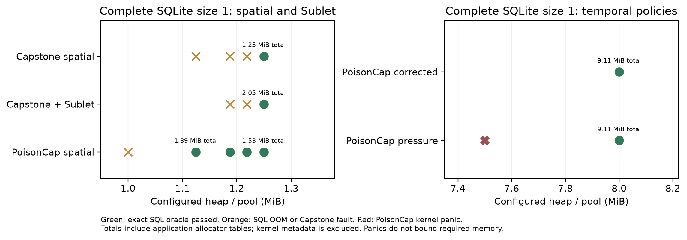
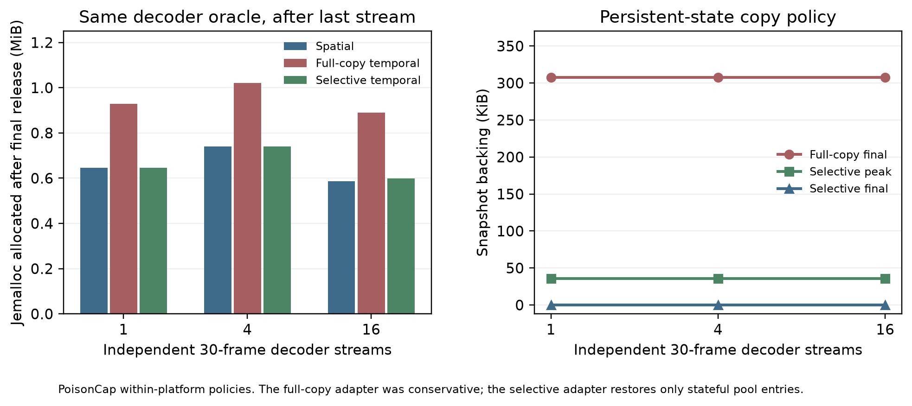

# Application memory follow-up (2026-09-27)

This exploratory follow-up varies the configured allocator budget for the full
SQLite 3.22.0 `speedtest1 main` workload and tests whether the FFmpeg 9.0.1
PoisonCap pool snapshot result survives a more selective adapter. Each passing
SQLite attempt matches all 32 independent native SQL-result phases (4,301 rows
at size 1; 8,604 at size 2). Each FFmpeg run matches the same decoded-frame
stdout byte for byte. [Curated records and source hashes](data.json) contain
21 SQLite attempts and 12 FFmpeg attempts; raw guest logs remain under
`/tmp/capstone`.



| SQLite `--size 1` arm | Smallest completed configured pool/heap **tried** | Application-visible reservation at that point | Lower attempt |
|---|---:|---:|---|
| Capstone spatial | 1.25 MiB | 1.25 MiB | 1.21875 MiB: capability fault |
| Capstone + memsys5 Sublet | 1.25 MiB | 2.05 MiB, including 843,776 B tables | 1.21875 MiB: capability fault |
| PoisonCap spatial | 1.125 MiB | 1.39 MiB, including free-list links and quarantine table | 1 MiB: SQL out of memory |
| PoisonCap corrected temporal | 8 MiB | 9.11 MiB, including links and quarantine table | 7 MiB in the earlier pilot: kernel panic |
| PoisonCap pressure-reclaim control | 8 MiB | 9.11 MiB | 7.5 MiB: kernel panic |

The 8 MiB pressure-reclaim control retries an allocation after revoking queued
blocks. It completes with the **same final allocator counters** as the corrected
policy, because this workload does not require a pressure retry at that budget.
The 7.5 MiB attempt reaches the published kernel's `Poison probe missing page`
panic. The 7 and 4.5 MiB corrected-policy attempts in the [first pilot](../sqlite-322-memory-20260927/README.md)
also panic. A kernel panic is not evidence that the workload needs more memory:
there is **no measured minimum** for the protected PoisonCap arm. The 2.05 vs
9.11 MiB comparison describes these *selected successful configurations* only.
The spatial control completes with a smaller configured heap on PoisonCap than
on Capstone; these are distinct allocators and platforms.

For `--size 2`, Capstone spatial and PoisonCap spatial pass the entire oracle
with 2.5 MiB configured payload. Capstone Sublet faults at
`sqlite3GenerateConstraintChecks` with both 2.5 and 3 MiB pools; its SQL oracle
does not complete. PoisonCap corrected temporal panics in the published kernel
with a 16 MiB heap after nine phases. This size has **no valid four-arm memory
comparison**. The Sublet fault is under investigation and should not be
presented as a measured capacity limit.



The original PoisonCap FFmpeg adapter retained a full 315,072 B pool snapshot
after decoding. The revised adapter snapshots only entries whose initialized
state persists across leases (`AVRefStructPool`), and releases those snapshots
with their final backing. It leaves `AVBufferPool` entries without a persistent
copy, because their previous contents are not part of the next lease's
contract. All 6/6 revised spatial/temporal decoder runs at 1, 4 and 16 streams
pass the frame oracle. Selective temporal snapshot backing peaks at 36,288 B
and ends at zero in each run. Final jemalloc allocated equals the spatial arm
at 1 and 4 streams, and is 13,632 B higher at 16 streams. The large apparent
FFmpeg memory advantage over PoisonCap therefore came from our conservative
adapter, **not** an inherent pool cost of PoisonCap.

These are one attempt per SQLite point and one PoisonCap attempt per FFmpeg
cell. Reservations are allocator-visible budgets, not RSS or resident pages;
kernel shadow, Capstone node metadata, and other platform memory are excluded.
The FFmpeg jemalloc series is a within-PoisonCap comparison and must not be
subtracted from Capstone's different outer-heap ledger. No security or runtime
speed result is inferred. Next investigate the kernel panic and Sublet size-2
fault, then rerun fixed budgets with repetitions and complete platform memory
accounting before a comparative memory claim.

To redraw the figures from committed data, after sourcing
`capstone/tests/capstone-test-env.sh`, run:

```sh
python3 capstone/experiments/study/plot-memory-followup.py \
  --data capstone/experiments/study/results/memory-followup-20260927/data.json \
  --out /tmp/capstone/memory-followup-figures
```

`plot-memory-followup.py --inputs /tmp/capstone/sqlite-memory-budget/inputs.json`
also rechecks each local raw transcript against the native SQL/frame oracles
and records its SHA-256. That scratch manifest is not required to redraw the
committed figures.
