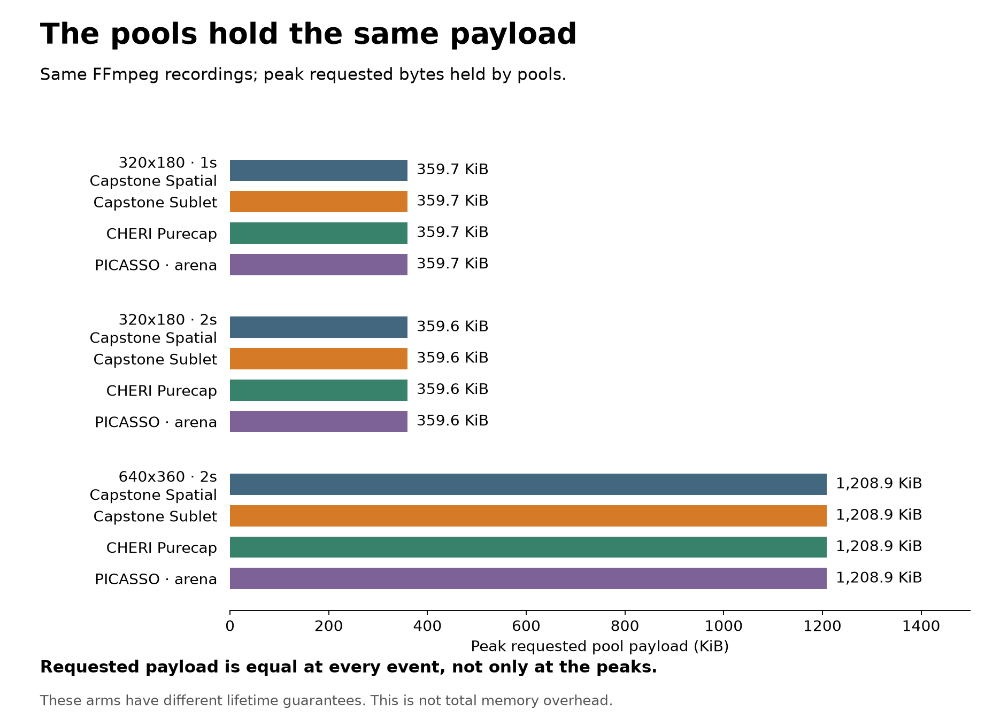
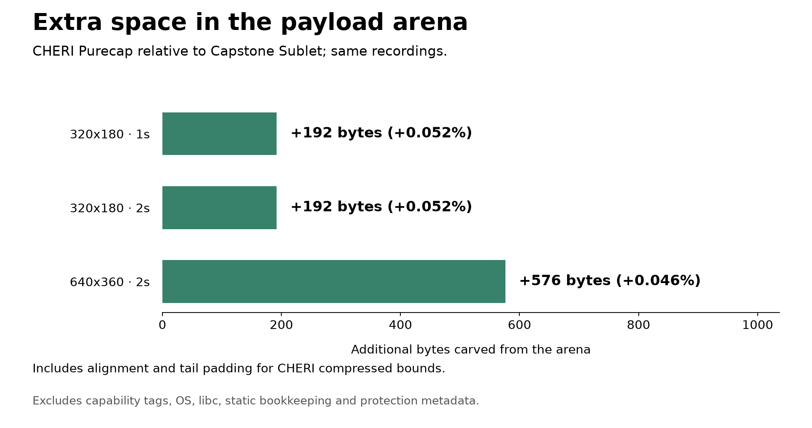

# CHERI and PICASSO arena replay comparison

The same three FFmpeg 9.0.1 recordings used by the
[Capstone spatial/Sublet campaign](../20260919-replay/README.md) are replayed
through the same patched AVBufferPool/AVRefStructPool sources in CheriBSD/QEMU.
All 18 new measurement points pass. The new backend issues bounded CHERI purecap pointers and accounts for the
alignment and padding required by compressed bounds. This is allocator replay,
not CHERI-protected video decoding.

## Memory behavior

The complete event sequences match native observations, including allocation
and backing identities, reuse gaps, live/retained requested bytes and callbacks.
Three fresh-VM repetitions per recording and arm produce identical output
binaries within each recording/arm. The paired payload curves agree at every
event, not merely at their peaks.

| Recording | Capstone payload carved, both modes | CHERI payload carved | PICASSO arena payload carved | CHERI extra carved | Metadata carved, all arms |
|---|---:|---:|---:|---:|---:|
| short, 320x180, 1s | 372,352 B | 372,544 B | 372,544 B | 192 B (0.052%) | 12,288 B |
| turnover, 320x180, 2s | 371,904 B | 372,096 B | 372,096 B | 192 B (0.052%) | 11,648 B |
| larger, 640x360, 2s | 1,242,240 B | 1,242,816 B | 1,242,816 B | 576 B (0.046%) | 12,288 B |

These percentages divide the extra carved payload bytes by Capstone's payload
carving watermark. They are **not total CHERI/PICASSO memory overhead**.
The largest bounds expansion of one issued pointer is 49, 49 and 177 bytes
respectively, measured by reading the issued capability length. Bounds cover
the requested payload and may include tail padding, but are checked to stay
within the backing block. Summed bounds slack in JSON is accumulated across
pointer issues, including trusted callback access; it is not concurrent waste.
Capstone bounds slack was not instrumented in this campaign and is null in the
comparison export.

## Protection exercised

The CHERI spatial arm explicitly disables libc heap revocation. The PICASSO
arm explicitly enables its installed colored-capability runtime. Every replay
checks its actual `malloc_revoke_enabled()` result and 16-byte pointer width.
Both use **spatial arena leases**, with no new per-return revocation adapter.

Five pool controls run in each new arm, in separate processes after the first
measurement. The two bounds probes use 64-byte objects. SIGPROT is required
after an explicit setup marker; a shell parent preserves the child's exit
status (162) instead of SSH's generic exit-signal result (255).

| Control | CHERI spatial arena | PICASSO arena |
|---|---|---|
| Valid aliases, callbacks and deferred pool close | completes | completes |
| Stale buffer after pool reuse | completes | completes |
| Stale refstruct after pool return | completes | completes |
| Refstruct access before its lower bound | SIGPROT | SIGPROT |
| Buffer access past its upper bound | SIGPROT | SIGPROT |

PICASSO additionally passes a separate libc heap control: a tagged, colored
64-byte allocation reports runtime revocation enabled, its normal allocate/free
path completes, and its post-`free()` access reaches the marker then SIGPROT.
Thus its runtime is active even though the two nested-pool stale cases complete.
Those arena suballocations do not pass through libc `free()` on pool return.
The previous Capstone/Sublet companion controls reject those stale pool cases.

This is a comparison of observed allocator behavior under **different lifetime
guarantees**. It does not establish PICASSO's cost with equivalent per-return
protection, nor that PICASSO cannot support a custom pool adapter. Such an
adapter and its costs are a separate experiment. The implementation boundary
is also described by the [official PICASSO artifact](https://github.com/coloredcapabilities/colored-artifact).

## Static storage and missing ledger entries

`elf-storage.json` separately inventories the measured executables' allocated
ELF sections, excluding debug sections. Zero-initialized static storage is
844,256 bytes for the Capstone domain and 952,568 bytes for each CHERI executable.
These are different runtime/ABI builds, not a pure protection-overhead ratio.

For example, the fixed-capacity object observer table occupies 458,752 bytes
in the Capstone executable and 524,288 bytes in CHERI; payload bookkeeping is
229,376 and 262,144 bytes respectively. The same C source stores numeric
identities in ABI-sized `uintptr_t` fields, which are capability-sized in the
CHERI build. This illustrates why harness storage must be reported separately
from allocator payload. It is not an unavoidable architectural cost claim.

Both targets reserve 64 MiB payload and 16 MiB metadata plus 128 MiB input and
128 MiB output. The CHERI guests have 2 GiB RAM/one CPU, versus 8 GiB/one CPU in
the previous Capstone campaign. This is not a matched OS-pressure or minimum
capacity experiment. Capability tag storage, PICASSO tables and sweeping costs,
Capstone nodes, dynamic libc/loader storage, OS memory and stacks are not a
complete ledger here. QEMU host elapsed time is never used as hardware timing.

## Provenance, failures and reproduction

Work starts from measurement branch commit
`d5426126c120dafc372f8bc66e666fb894ad9f14`; native recording bytes are reused and
hash-checked against that campaign. The CHERI source revisions are:

| Component | CHERI spatial installation | PICASSO installation |
|---|---|---|
| LLVM | `7e122876ee01a7a82585f7674c94f12fc1cc7689` | `578ea4f7ef67d589f0ca7d10ec9e383333567421` plus artifact patches |
| QEMU | `e32bc30f80469626a880b5606a901916704b441c` | `967e7a86d8d7d1b0a730640354269afebaa0c3ed` plus artifact patches |
| CheriBSD | `88f39900c32928d807dba245fba138808c666f34` | `485c1c8195563d2be65ed2eb1bf7d8bc06eb1a64` plus artifact patches |

PICASSO artifact checkout: `fb467f5b0b3137b997f4415fa55fdaa59b6d2213`.
The exact compiler, emulator, firmware, kernel, libc, image, executable,
collector and build-configuration hashes accompany the results. Revision names
alone do not identify the patched installations. Both replay builds use Debug
(no optimization flag), RISC-V `rv64imafdcxcheri` and the `l64pc128d` purecap ABI.
These identify these installed CHERI implementations, not every CHERI ISA variant.

The original PICASSO image was in use by another guest. Its failed launch is
retained; a separate disk image was packaged from the installed rootfs with
that artifact's cheribuild/makefs/mkimg tools. Every accepted run uses a fresh
single-user snapshot, fixed network setup and an explicitly confirmed process
policy. The surrounding OS startup differs from the previous Capstone campaign.

`attempts.json` records excluded pilots and setup failures. No failed attempt
is silently retried or reclassified. SSH-readiness polling is recorded separately
and does not retry a replay. Raw data remain under
`/tmp/capstone/cheri-replay-work/`: `campaign-spatial-5`, `campaign-picasso-2`,
build directories, the fresh image and its creation log, and excluded attempts.
They contain guest banners and temporary private SSH keys and are not public
artifacts. The committed JSON/CSV/plots are compact evidence; regenerating them
requires the external binary results.

The [CHERI runner guide](../../../host/cheribsd/README.md) gives build,
measurement, checked export and plot commands. The export rechecks all complete
event sequences and repeats before collapsing them. Two negative checks reject
a copied result with one modified byte and an incomplete campaign, without
creating an export directory. Three native CTests pass, and the fresh native
build reproduces all three recorded event sequences after the shared allocator
change. The native stock/instrumented decoder comparison belongs to the source
campaign; those captures were reused, not recreated.
