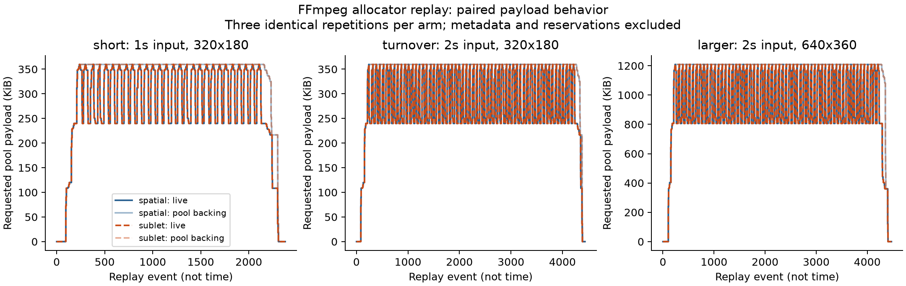

# Paired FFmpeg allocator measurements in QEMU

All 18 planned measurement points passed: three freshly recorded workloads,
spatial and Sublet, three fresh-VM repetitions each. Every replay's complete
event sequence matches its native recording, including pool backing decisions,
reuse gaps and nested callback effects. Within each workload and arm, all
three result binaries are bit-identical. Stock and instrumented native decoder
frame hashes agree, and extracted native replay matches the recording.

## Measured resources

Values below are bytes. Spatial and Sublet have the same payload and metadata
carving watermarks for each recording. The last two columns are Sublet's
software counters; spatial reports zero revokes and zero initialized bytes.

| Recording | Frames | Events | Payload carved | Metadata carved | Peak live requested | Sublet revokes | Sublet initialized bytes |
|---|---:|---:|---:|---:|---:|---:|---:|
| short, 320x180 | 30 | 2,379 | 372,352 | 12,288 | 368,258 | 520 | 373,504 |
| turnover, 320x180 | 60 | 4,437 | 371,904 | 11,648 | 368,226 | 963 | 373,056 |
| larger, 640x360 | 60 | 4,473 | 1,242,240 | 12,288 | 1,237,832 | 969 | 1,243,392 |



The x-axis is replay events, not time. Solid spatial and dashed Sublet curves
overlap exactly. Each curve represents three identical repetitions. Light
curves include live objects and idle backing still owned by the pools; idle
bytes alone are their difference. Both live and pool-owned requested payload
return to zero at completion.

The recordings contain native scheduling variation: the 30-frame and 60-frame
inputs do not have identical startup allocator histories. Their small
watermark difference is not a protection effect. The repeatability statement
applies to replay of a fixed recording, not to independently recording it again.

## Scope and limits

This is FFmpeg 9.0.1 AVBufferPool/AVRefStructPool replay with a shared backing
implementation across the two modes. It is not protected video decoding.
Callback effects are replayed, not the decoder's computations or real payload
access pattern. Native capture and replay share observer code; exact agreement
does not replace independent accounting controls or establish every interleaving.

Payload and metadata carving watermarks are the monotonic extents consumed
from the port's reusable arenas. They are not live occupancy or a complete
memory ledger. Both modes reserve 64 MiB payload and 16 MiB metadata, plus
128 MiB input and 128 MiB output regions for the replay. Static domain and
driver storage and physical node/tag storage are outside these four numbers.
The configured QEMU node capacity is 1,048,576. Its storage is not free, and
this experiment does not measure live node occupancy or minimum capacities.

The result supports preserved observed allocator behavior at these fixed
budgets. It does not establish zero total memory overhead, hardware runtime,
cache/DRAM traffic, sustainable node reclamation or an architecture-wide bound.

## Failed attempts and controls

The first campaign stopped after 11 accepted points. Its next replay returned
success and copied a 4,437-event result that independently matches the native
recording, but the runner timed out before confirming guest-command completion.
That attempt remains failed and the first campaign is excluded from the table.

The second campaign also initially stopped after 11 accepted points, this time
with a boot-login timeout before replay. It was explicitly resumed after
diagnosis. Completed outputs and original execution artifacts were rechecked;
only the unfinished point received a new attempt. The failed row remains in
`summary.csv` and `measurements.json`, alongside all 18 accepted points. The
collector gained explicit resumption support; old manifest and collector
hashes remain in the external campaign. Later collector hardening rejected
changed build selections as well as changed file contents; its negative
control passed and does not change the recorded binary measurements.

Six companion lifetime controls from the same fresh domain build passed:
valid references/callbacks/deferred close in both modes, and buffer-after-reuse
and refstruct-after-return accesses in both modes. Spatial completes the stale
accesses; Sublet faults at the expected access PC with the expected cause.
These are separate protection-activity checks, not performance measurements.

Four native CTests pass, including six focused measurement/accounting/resume
controls and native recording/replay checks. The accounting controls reject
wrong modes, failures, inconsistent totals and changed observations, and
distinguish synchronized peaks from the sum of per-kind maxima.

## Provenance and reproduction

`measurements.json` includes input/output and compiler, linker, QEMU, firmware,
kernel, rootfs and domain hashes. The baseline source commit is
`aef778b5c6a47c10ac3508f3974b00c733b895cd`; measurement tooling was added in the
working tree and is separately fingerprinted. The domain build uses the Debug
preset (`-g`, no additional optimization flag), capability atomics and musl
headers. The Linux loader uses its Release preset. Each guest uses
`virt-capstone`, 8 GiB RAM, one CPU, snapshot rootfs and `cma=512M`.

Raw artifacts remain outside the checkout:

- `/tmp/capstone/replay-measurement-work/campaign-1`: excluded first campaign.
- `/tmp/capstone/replay-measurement-work/campaign-2`: accepted matrix and retained failure.
- `/tmp/capstone/replay-measurement-work/lifetime-controls`: companion checks.
- `/tmp/capstone/replay-measurement-work/ffmpeg/build`: independent fresh builds.

`commands.json` and the full manifest in each campaign retain literal commands,
source hashes, build-cache hashes and resumption history. Local raw files are
not a portable public dataset. The JSON/CSV records and figure here are compact
evidence; regenerating the figure requires those raw result binaries.

From the repository root, prepare the documented toolchain environment and
fresh native, domain and Linux builds. Then:

```sh
source capstone/tests/capstone-test-env.sh
export CAPSTONE_REV_NODES=1048576
python3 capstone/ports/ffmpeg/buffer-pool/host/memory/measure.py "$RESULTS" \
  --native-build "$NATIVE_BUILD" --domain-build "$DOMAIN_BUILD" \
  --linux-build "$LINUX_BUILD" --repetitions 3 \
  --workload short=1,320x180 --workload turnover=2,320x180 \
  --workload larger=2,640x360
python3 capstone/ports/ffmpeg/buffer-pool/host/memory/export-measurements.py \
  "$RESULTS" "$EXPORT"
python3 capstone/ports/ffmpeg/buffer-pool/host/memory/plot-measurements.py \
  "$RESULTS" "$PLOTS"
```

Choose new output directories. Native recordings may differ while preserving
decoded frames; compare each replay to its own recording. A diagnosed failure
may use explicit `--resume --resume-reason ...` with unchanged execution
artifacts and matrix. No failure is silently retried or reclassified.
