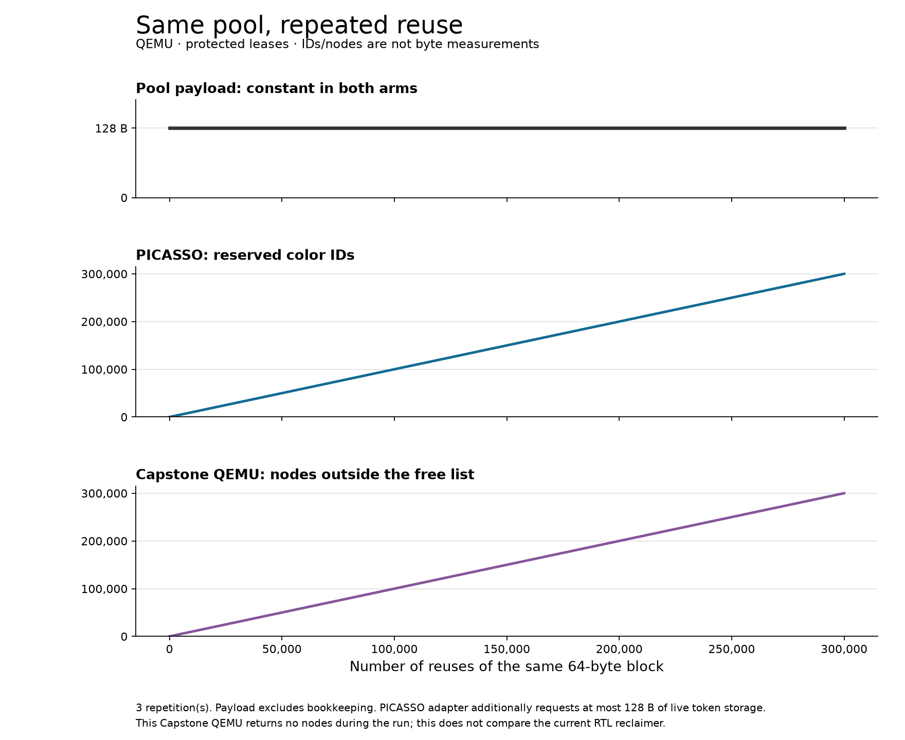
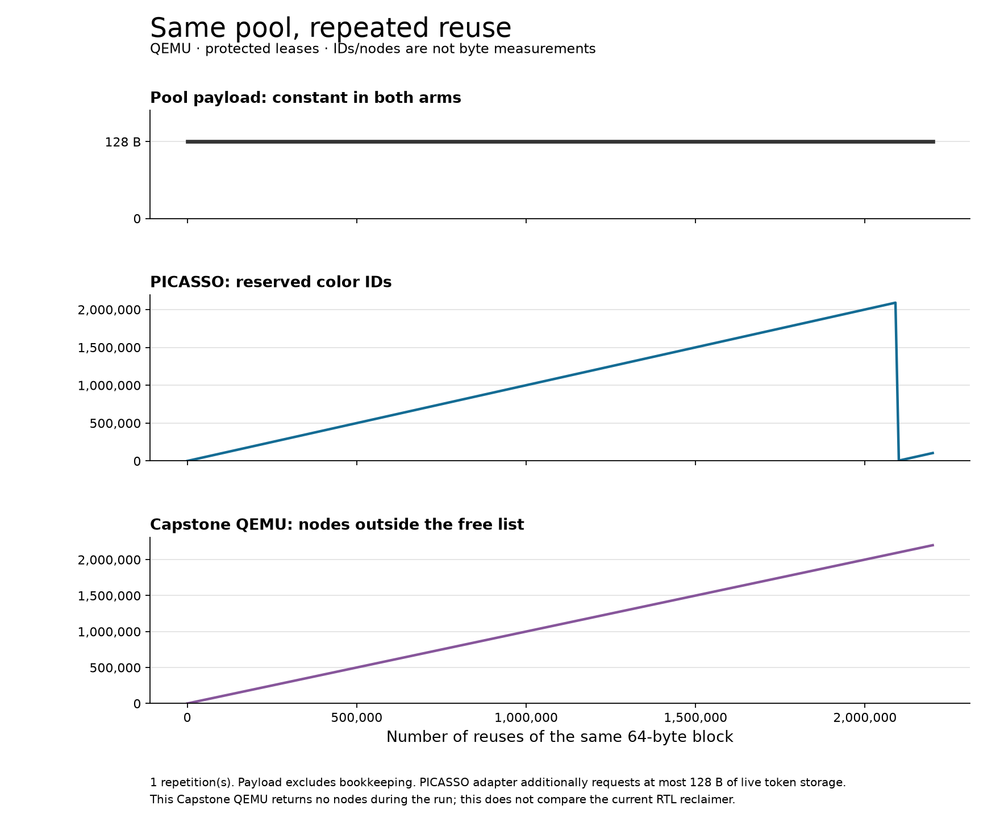

# Protected pool reuse: PICASSO adapter and Capstone QEMU

The added PICASSO adapter protects individual FFmpeg pool leases: it assigns
a fresh libc-owned color on issue and invalidates it on return. Nine replays
of the three existing native recordings match every native event. This is
source-level allocator replay and synthetic pool churn, not protected decoding.

## What the experiment tests

Two 64-byte FFmpeg buffers share a pool. One remains live; the other is returned
and reissued at the same address. Every iteration checks the current values of
both buffers. One old pointer is retained throughout. The valid case completes;
the matched stale case accesses that old pointer after the same churn and must
fault. Aliases, callbacks, deferred close, and short stale-return/reuse cases
provide companion controls.

Three repetitions of 300,000 reuse rounds pass on both arms. There are 36
accepted companion-control executions, including the paired churn cases.

| At round 300,000, before final cleanup | PICASSO token adapter | Capstone Sublet, pinned QEMU |
|---|---:|---:|
| Pool payload carved | 128 B | 128 B |
| Pool metadata carved | 1,344 B | 1,344 B |
| Peak live requested token storage | 128 B | not used |
| Reserved color IDs | 300,007 | not applicable |
| Node entries outside the free list | not applicable | 300,050 |
| Stale access after reuse | SIGPROT | expected capability fault at the probe PC |

Color IDs and Capstone nodes are different resources: **these counts are not
bytes and cannot be divided into a total-memory-overhead ratio**. PICASSO's
identifier allocator compresses consecutive runs of IDs, and its PVT has a
fixed size for the selected encoding. A growing busy-ID count does not imply
proportional RAM growth. Token payload is specific to this adapter; a direct
color allocator API could avoid those token allocations.

The pinned Capstone QEMU accumulates node entries and shows an empty free list.
Source inspection finds the refcount-update helper defined without call sites;
the allocator consumes unused IDs before its free list. This experiment does
not exercise the newer RTL reclaimer. A flat Sublet space curve must not be
inferred from successful payload reuse or from the configured node capacity.

## Beyond the PICASSO color threshold

The original 300,000-round protocol incorrectly expected to cross the color
threshold. The installed PICASSO encoding has 21 bits; the compiled binary
reports a threshold of **2,095,148**. A separately identified extension uses
2,200,000 rounds, one repetition, and a larger explicit Capstone node capacity.
The protocol correction and all excluded attempts are retained in `attempts.json`.

PICASSO's valid extension completes one recycling sweep. At round 2,090,000,
2,090,007 color IDs are reserved; at round 2,100,000 that falls to 4,863.
At round 2,200,000 it is 104,863. Two tokens remain live throughout the churn,
and the old pointer still faults in the matching stale case after recycling.
This is a functional recycling result, not a hardware latency measurement.

Capstone's extension also completes and rejects the stale access at the
expected probe PC. At round 2,200,000 it reports 2,200,050 allocated nodes and
zero free-list entries, with a declared node capacity of 4,194,304. Payload and
pool metadata still match the shorter campaign. The extension contributes
one additional native-recording replay and nine accepted companion controls.

`extension/` preserves this single-repetition result separately. It is not a
three-repeat estimate or evidence of hardware pause duration. PICASSO completes
the same immediate address reuse even when it must recycle its color IDs;
this experiment therefore does not demonstrate a Sublet reuse advantage.

## Hierarchical protection is a different requirement

This experiment adapts a **trusted pool manager**. It does not demonstrate
automatic protection of arbitrary nested allocators. Each lease has a flat,
independent color; invalidating a parent color does not automatically invalidate
distinct child colors. Parent/child bookkeeping and its costs need a separate
comparison. The paper's trusted-allocator assumptions and malloc/free hooks
are described in [PICASSO sections 3 and 6.2](https://arxiv.org/html/2602.09131v1).
Its PostgreSQL benchmark is not by itself an evaluation of protected internal
Memory Context lifetimes. The paper does not separately evaluate that property.

The adapter retains recoloring authority from an `mmap` arena, gives each
bounded lease the color of one 64-byte libc token, removes recoloring permission,
and frees the token on return. This is our added integration, not an upstream
PICASSO nested-allocator implementation. It keeps the underlying pool's address
reuse and callbacks intact. Code, libc, kernel and QEMU remain pinned separately.

## Reproduction and limits

Use the [runner guide](../../../host/cheribsd/README.md) and
[protocol](../../../../../../docs/plans/pool-temporal-reuse.md).
`main/measurements.json` and `main/checkpoints.csv` preserve all repetitions;
the export rechecks input/output and platform hashes, complete native event
sequences, setup markers, fault evidence and checkpoint coverage. Negative
checks reject an incomplete campaign and an output with one changed byte
without creating a result directory. Three native CTests pass.

Raw campaigns live outside the checkout under
`/tmp/capstone/temporal-reuse-work/`; CHERI raw directories contain temporary
private SSH keys and guest banners and are not shareable result bundles.
Only normalized results, hashes and plots belong here. The branch starts at
`103b48c50ad2884245d87ba2b2c0c11d4c4392b2` (PR #61). Build/source fingerprints
identify the initial and extended binaries separately. The extension changes
the supported rounds limit and prints the compiled PICASSO threshold.

Neither this experiment nor its curves establish total protection-memory cost,
application speed, hardware timing, or an advantage of the Capstone architecture.
They establish protected pool reuse in these integrations and expose the next
comparison requirements: hierarchical lifetime semantics and a Capstone model
that actually implements the intended node reclamation.
